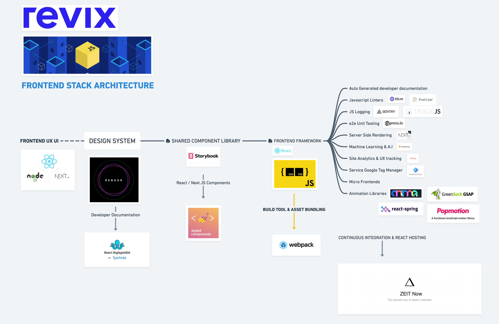
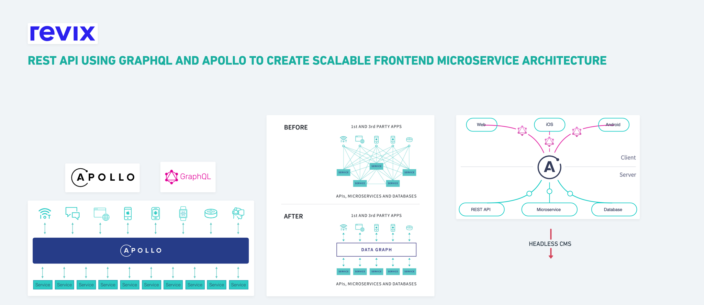

# Revix Frontend Boilerplate
> Latest Serverless Technology Boilerplate with cutting edge framework integrations.

[![NPM Version][npm-image]][npm-url]
[![Build Status][travis-image]][travis-url]
[![Downloads Stats][npm-downloads]][npm-url]

I will update this doc with some better documentation soon.




## Installation

OS X & Linux:

```sh
yarn install
```

Windows:

```sh
yarn install
```

## getting started

```sh
yarn build
```

```sh
yarn dev:next
```


## Release History

* 0.0.1
    * This Repo you are looking at

## Brought to you by:

James Cells - jamescellsct@gmail.com
